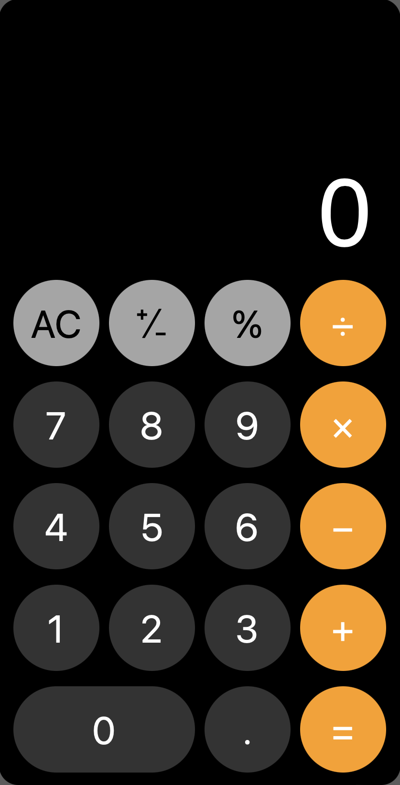

# Project: Calculator
- Developer: [David M. O'Mullan](https://github.com/davidomullan)
- Guidelines: [The Odin Project](https://www.theodinproject.com/lessons/foundations-calculator)

## Implementation
- [x] Support for addition, subtraction, multiplication, and division
- [x] String multiple operations (i.e. Press '5' => '+' => '2' => '-' => '3' => '=' displays 4)
- [x] Implement '%' button ('5', '%' = 0.05)
- [x] Implement &#8314;&#8725;&#8331; button (toggles sign on current operand)
- [x] Stylize (mock iOS calculator app)
- [x] Reduce font-size on overflow of screen
- [X] Support for decimal values (and decimal key)

